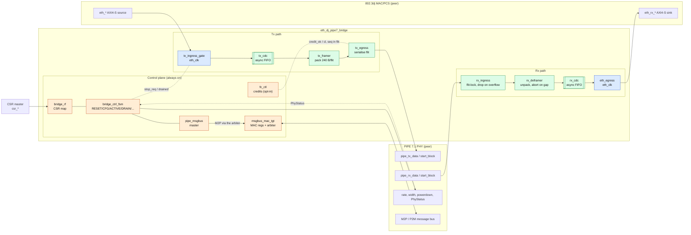
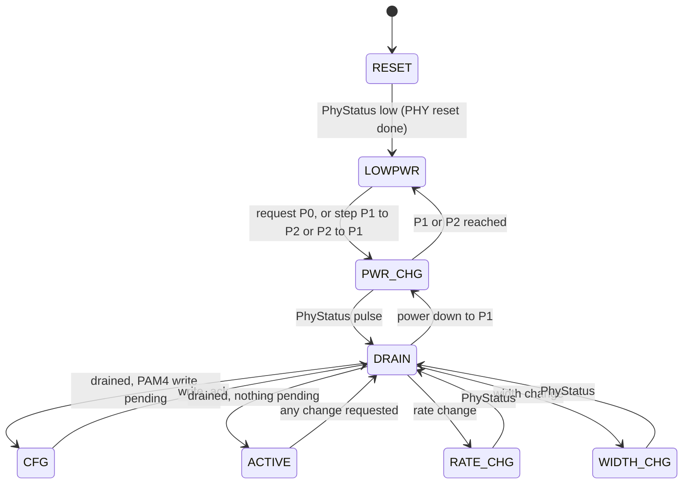
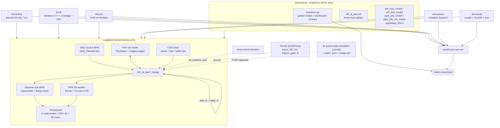

# eth-dj-pcie-pipe7_1-bridge

RTL digital design for a **bridge from an IEEE 802.3dj Ethernet MAC/PCS packet
interface to a PCIe PIPE 7.1 MAC-facing parallel interface**, verified in five
independent testbench stacks and wired into CI, a metrics dashboard, and an
optional AI agent swarm.

**Baseline: PAM4.** The PIPE side targets **PCIe Gen6 (64 GT/s, PAM4, FLIT
mode)** and the 802.3dj side is **200G/lane PAM4** — both ends are PAM4-native.
See [`docs/pam4_notes.md`](docs/pam4_notes.md).

> **Status: first cut complete (M0–M7; M8 close-out).** Tx + Rx datapaths and the
> PIPE control plane; five DV environments (Icarus, Verilator C++, SystemC,
> cocotb+PyUVM, UVM-on-Verilator) agree on a shared scenario set; line+branch
> coverage 92.5% (floor 80%); bind-based SVA; SymbiYosys PDR proofs; UPF power intent
> (**authored, not run** — no OSS power-aware simulator); GTKWave sessions,
> metrics dashboard, Docker/Railway job and agent-swarm definitions.
> Open owner decisions: [`docs/OPEN_DECISIONS.md`](docs/OPEN_DECISIONS.md).
> Progress: [`docs/PLAN.md`](docs/PLAN.md) §11, [`docs/AGENT_HANDOFF.md`](docs/AGENT_HANDOFF.md).

## What this bridge does

Ingress 802.3dj (PAM4) Ethernet frames (delivered as an AXI4-Stream-style packet
interface off the MAC/PCS) are adapted, clock-domain-crossed, width-geared, and
framed onto a PCIe **PIPE 7.1** MAC-facing datapath in **Gen6 FLIT mode** (256B
flits, parallel TxData/RxData plus the 8-bit PIPE message bus for PAM4 controls; rate/width/
power-state changes use the PIPE pins and the PhyStatus handshake). The reverse direction deframes PIPE RxData back
to Ethernet packets. See [`docs/PLAN.md` §2–§3](docs/PLAN.md) for interface and
microarchitecture detail.

## Block diagrams

### Design

The bridge sits between an existing 802.3dj MAC/PCS (AXI4-Stream packet interface) and a PIPE 7.1
PHY. Ethernet frames are cut into 256-byte Gen6 flits and sent on PIPE Tx; PIPE Rx flits are put
back together into frames. A small control plane owns the PIPE pins (rate, width, powerdown), the
message bus and the CSR port. Blue = `eth_clk` domain, green = `pclk` domain, orange = control plane.



Control FSM (`rtl/bridge_ctrl_fsm.sv`); one operation at a time, always after a drain:



The PD_DP datapath instances (everything except the control plane) are held in reset from
`LOWPWR` to the next `DRAIN` (D18, default), so a power-gated datapath needs no retention.

### Testbench

Every environment drives the same DUT through the same loopback harness (PIPE Tx wired back to
PIPE Rx) and runs the same five scenarios against one golden model; `make crosscheck` compares
their `results.json` files.



Directed Icarus tests beyond the shared scenarios: `tb_smoke`, `tb_tx`, `tb_loop`, `tb_pm`
(power/rate/width under traffic), `tb_rxovf` (Rx overload), `tb_msgbus`, `tb_msgbus_mac`,
`tb_link` (two bridges back to back, flow control).

## Tutorial

New to the buses or the repo? [`docs/TUTORIAL.md`](docs/TUTORIAL.md) walks through the bus
standards (AXI4-Stream, PCIe Gen6 flits, PIPE 7.1 pins and message bus), the design (a frame's
journey, the flit format, CDC, the control FSM, power states) and the testbenches (BFMs, the
scenario contract, how to run, debug and extend them).

## Quick start

```bash
make regress     # lint + Icarus directed tests + shared scenarios — the fast CI gate
make coverage    # Verilator env + SVA -> coverage.info (floor 80% line+branch)
make formal      # SymbiYosys prove + cover (needs the pinned OSS CAD Suite)
make ci          # every CI step: regress, coverage, formal, all envs (+ flow control), crosscheck, lanes4, waves, pd-emu
make stress      # all scenarios x 20 seeds on Verilator
make wave-loop   # run a test with a VCD dump, check + open dv/waves/loop.gtkw
make metrics     # run + time the flows -> metrics/metrics.db; make dashboard renders it
make upf         # UPF TB on VCS-NLP / Xcelium / Questa-PA if on PATH, else a missing-tool notice and exit 0
```

Tools: the OSS CAD Suite pinned in CI (`2026-04-13`: Verilator 5.047, Icarus,
Yosys+slang, SBY) is needed for `uvm` and `formal`; apt Icarus/Verilator 5.020
run everything else. cocotb env: `pip install -r dv/cocotb/requirements.txt`.
Or use the container: `docker build -t bridge-ci . && docker run --rm bridge-ci`.

## Layout

See [`docs/PLAN.md` §4](docs/PLAN.md). In brief: `rtl/` (design), `dv/`
(five verification environments: `iverilog/`, `vlt/`, `uvm/`, `systemc/`,
`cocotb/`), `dv/sva/` (assertions), `formal/` (SymbiYosys), `lp/` (UPF power
intent), `metrics/` (dashboard), `docker/` + `.claude/agents/` (agent swarm),
`.github/workflows/` (CI), `docs/` (this plan).

## Workspace conventions

This repo lives under `~/proj` and inherits `~/proj/CLAUDE.md` and
`~/proj/DV_STANDARDS.md`. Tool versions are pinned in `~/proj/dv_env.mk`
(`OSS_CAD_SUITE_VERSION`, `cocotb==1.8.1`).
